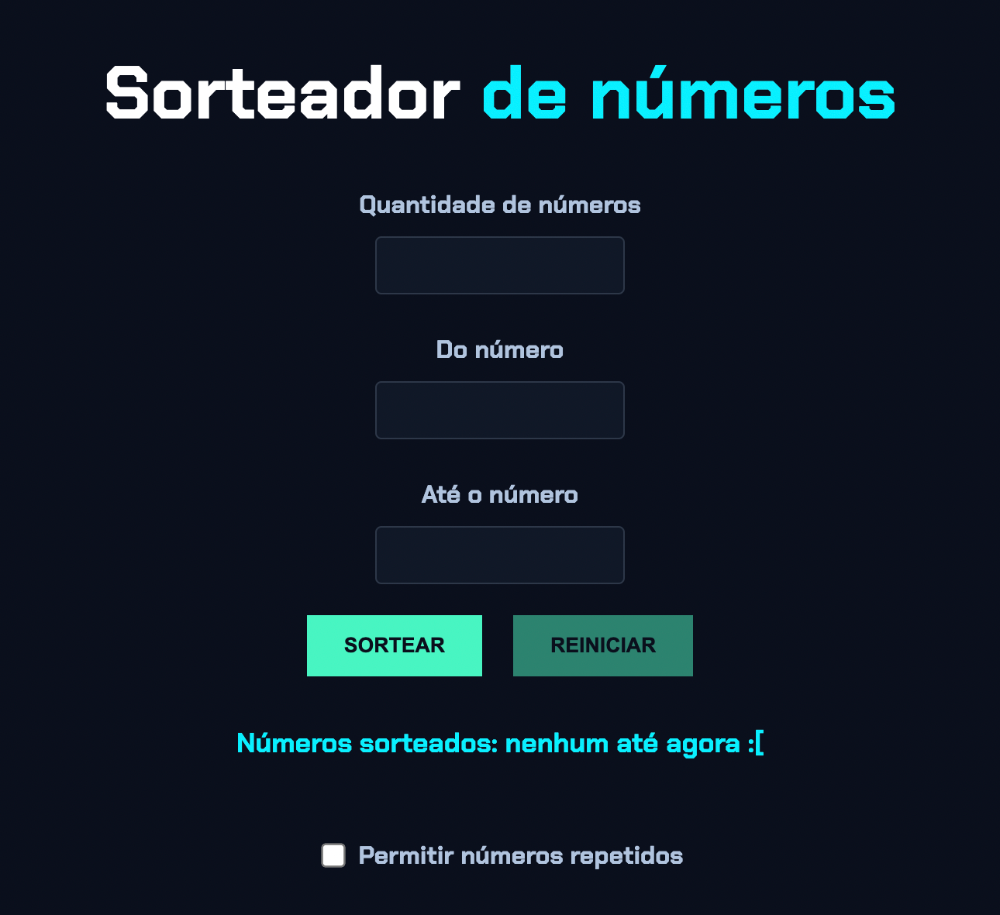

# 🎲 Sorteador de Números / Number Drawer

Um pequeno projeto de sorteador de números, desenvolvido com HTML, CSS e JavaScript.  
Este app foi criado como parte de um curso da [Alura](https://www.alura.com.br/) para praticar lógica de programação, manipulação do DOM e estilização com um layout moderno e responsivo.

## 📸 Preview

 <!-- substitua pelo nome real do arquivo da imagem ou link externo -->

## 🚀 Tecnologias utilizadas

- HTML5
- CSS3 (com foco em design moderno e acessível)
- JavaScript (DOM, lógica condicional e eventos)

## ⚙️ Funcionalidades

- Sorteia números aleatórios entre um intervalo definido.
- Permite definir a quantidade de números sorteados.
- Checkbox para permitir ou bloquear números repetidos.
- Validação de entradas e mensagens amigáveis de erro.
- Botão de reinício com reset visual e funcional.
